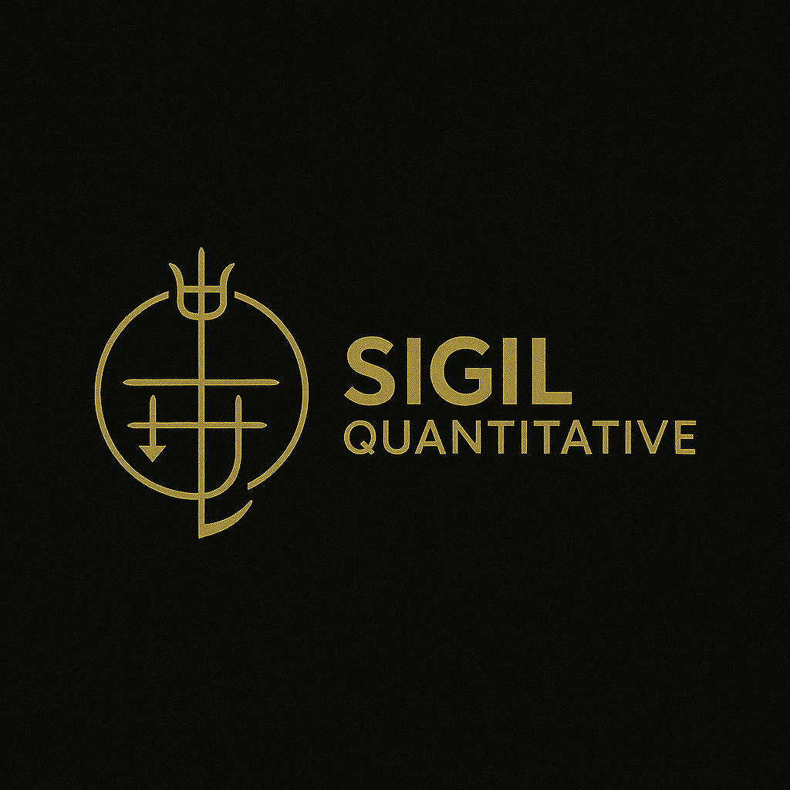

# SIGIL Quantitative

**Strategic Intelligence Gathering and Investment Logic**

*A quantitative trading research and development platform*

---

## Overview

SIGIL is a comprehensive quantitative trading research platform focused on systematic strategy development, rigorous backtesting, and data-driven decision making. The project encompasses multiple specialized tools and frameworks designed to support the complete lifecycle of quantitative trading strategy development.

## Philosophy

SIGIL is built on the principle that successful quantitative trading requires:

- **Systematic Analysis**: Data-driven strategy development with robust statistical validation
- **Risk Management**: Comprehensive risk assessment and position sizing methodologies
- **Reproducibility**: Consistent backtesting frameworks that validate across platforms
- **Continuous Improvement**: Iterative refinement through performance measurement and optimization

## Project Structure

SIGIL is organized as an umbrella project containing multiple specialized components:

### Trading Strategies ([PINESCRIPT](PINESCRIPT/))

TradingView Pine Script implementations of quantitative trading strategies:

- **HFM (ATR Hedge Fund Manager)**: ATR-based Renko momentum strategy with Turtle position sizing
- **TRAMA Turtle**: Triple Hull Moving Average with adaptive TRAMA cloud crossovers
- **Options Momentum**: Options-based momentum trading strategies

Each strategy includes comprehensive parameter optimization frameworks and performance validation.

### Data Analysis Tools

**TradingView Data Helper**: Python GUI application for processing and analyzing backtest results
- Automated calculation of 13 advanced performance metrics
- Risk-adjusted CAGR with custom ERP-based formula
- Export format optimized for statistical analysis and visualization

### Backtesting Framework

**Python Backtester**: Professional backtesting engine for strategy validation
- Replicates TradingView Pine Script logic for cross-platform validation
- Multiple data sources (Databento, Yahoo Finance)
- Parameter optimization with parallel processing
- Integration with data analysis tools

### Additional Components

- **Risk Management**: Position sizing algorithms (Turtle method, Kelly criterion)
- **Performance Metrics**: 13 custom metrics beyond standard Sharpe/Sortino ratios
- **Visualization Tools**: Interactive charts and performance dashboards

## Core Methodologies

### Position Sizing
- **Turtle Method**: ATR-based position sizing for consistent risk management
- **Dynamic Scaling**: Position multipliers for portfolio-level allocation

### Performance Measurement
Beyond standard metrics, SIGIL employs custom calculations including:
- Risk-Adjusted CAGR (custom ERP formula with trade frequency)
- Calmar Ratio (return efficiency vs. maximum drawdown)
- Hedge Quality Index (loss management effectiveness)
- Trade Duration Efficiency (time-normalized profitability)
- Tail Risk Analysis (outlier loss measurement)

### Strategy Validation
- Cross-platform backtesting (TradingView vs. Python)
- Parameter robustness testing
- Walk-forward optimization
- Monte Carlo simulation (planned)

## Technology Stack

- **Pine Script**: TradingView strategy implementation
- **Python**: Backtesting, data analysis, optimization
- **Market Data**: Databento (professional), Yahoo Finance (free tier)
- **Analysis**: Pandas, NumPy, Matplotlib, Plotly

## Development Principles

1. **Modular Architecture**: Independent components that integrate seamlessly
2. **Extensibility**: Designed for easy addition of new strategies and tools
3. **Performance**: Optimized for large-scale data processing and parameter sweeps
4. **Validation**: Multi-platform testing ensures strategy robustness
5. **Documentation**: Comprehensive guides for reproducibility

## Getting Started

Each component includes detailed documentation:
- **Pine Script Strategies**: See [PINESCRIPT/](PINESCRIPT/) for strategy details and parameters
- **Data Analysis**: Refer to component-specific documentation
- **Backtesting**: Review setup guides and examples

## Project Status

**Active Development** - SIGIL is under continuous development with regular enhancements to existing tools and new component additions.

Current focus areas:
- HFM strategy optimization (4,935 parameter combinations)
- Python backtester validation against TradingView results
- Enhanced performance metrics and visualization tools

---

**SIGIL Quantitative**
*Systematic Trading Through Rigorous Analysis*

